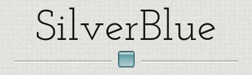
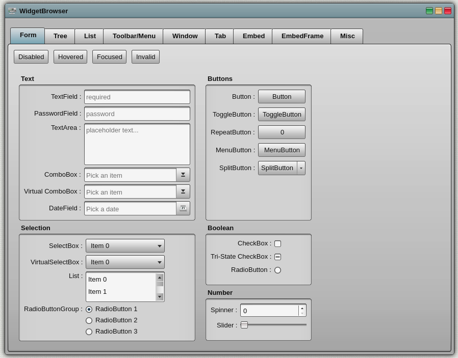

<!-- PROJECT LOGO -->
<br />
<p align="center">
  <a href="https://github.com/goldim/SilverBlueTheme">
    
  </a>

  <h3 align="center"></h3>

  <p align="center">
    A theme for the Qooxdoo JavaScript Framework
  </p>
</p>

<!-- ABOUT THE PROJECT -->
## About The Project

Just like the «DarkTheme», «SilverBlue» uses many tiny image files for constructing a GUI, so initial rendering of widgets may be a bit delayed, depending on the speed of your internet connection.

**Form Controls**


<!-- GETTING STARTED -->
## Using the Theme in your Application
To use the Theme in your application, go into the application root directory and install the theme into your project:
```sh
$ qx package update
$ qx package list
$ qx package install goldim/SilverBlueTheme
```
now you just have to modify your compile.json to enable the theme:
```json
"applications": [
  {
    ...
    "theme": "silverbluetheme.theme.Theme",
    ...
  }
],
```

## TODO

 - Fix a media player knob

<!-- LICENSE -->
## License

Distributed under the MIT License. See `LICENSE` for more information.

<!-- CONTACT -->
## Contact

Norbert Schröder - [@scro34](http://scro34.de/) - email: n.schroeder@scro34.de
Dmitrii Zolotov - [@goldim](https://github.com/goldim) - email: zolotovdy@yandex.ru
